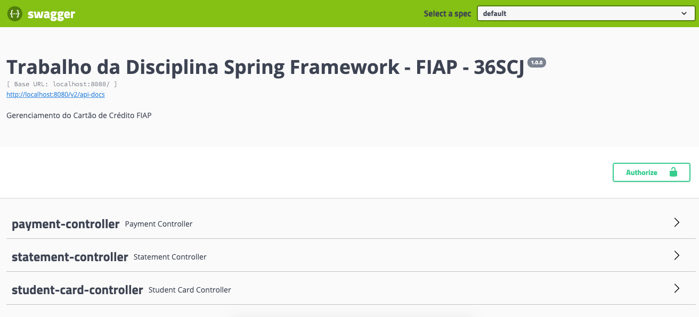
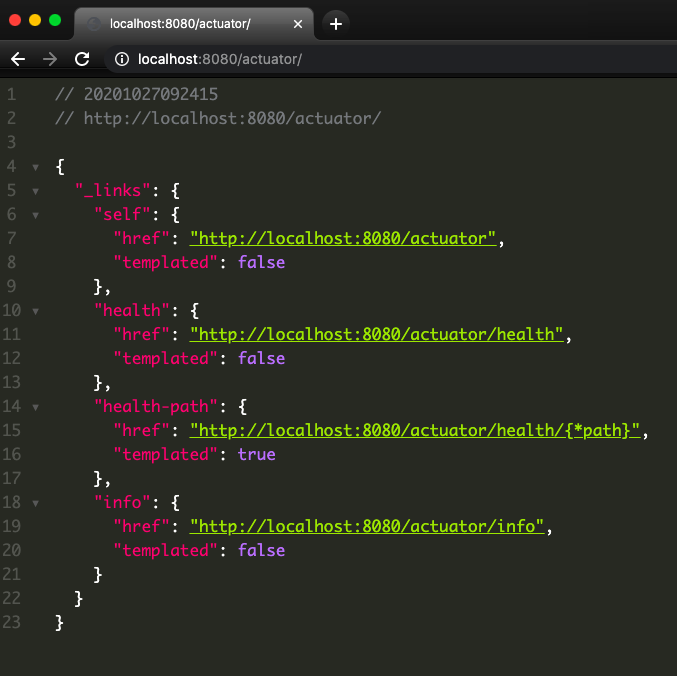

<h1 align="center">Spring Framework</h1>
 <p align="center">
   <a href="#-projeto">Projeto</a>&nbsp;&nbsp;&nbsp;|&nbsp;&nbsp;&nbsp;
   <a href="#tecnologias">Tecnologias</a>&nbsp;&nbsp;&nbsp;|&nbsp;&nbsp;&nbsp;
   <a href="#rotas">Rotas e Endpoints</a>&nbsp;&nbsp;&nbsp;|&nbsp;&nbsp;&nbsp;
   <a href="#swagger">Swagger</a>&nbsp;&nbsp;&nbsp;|&nbsp;&nbsp;&nbsp;
   <a href="#actuator">Actuator</a>&nbsp;&nbsp;&nbsp;&nbsp;&nbsp;&nbsp;
 </p>

   <p align="center">
    
  </p>


 ## 💻 Projeto
 Projeto referente a disciplina de Spring Framework, do MBA da [FIAP](https://www.fiap.com.br/mba/mba-em-full-stack-developer-microservices-cloud-e-iot/). A FIAP resolveu criar seu próprio cartão de crédito para ser utilizado pelos alunos e para isso necessita de um sistema para gerenciamento e integração com outras empresas.
 ## :rocket: Tecnologias
 - Java 8
 - Gradle - Gerenciador de dependências 
 - H2 - Banco de dados da aplicação
 - Spring Boot - Subir a aplicação e carregar os contextos da aplicação
 - Spring Batch - Processamento do arquivo de cadastro dos alunos
 - Spring Data - Manipulação e gerenciamento do banco de dados
 - Spring Security - Autorização de rotas


## Rotas e Endpoints

- Consultar todos os estudantes e os dados de seu cartão
```(GET -> /spring/v1/student/credit-card)```
- Associar um estudante a dados de seu cartão
```(POST -> /spring/v1/student/credit-card)```
- Consultar um estudante específico com os dados do seu cartão
```(GET -> /spring/v1/student/credit-card/{id})```
- Alterar informações 
```(PUT -> /spring/v1/student/credit-card/{id})```
- Excluir dados
```(DELETE -> /spring/v1/student/credit-card/{id})```
- Processar um pagamento
```(POST -> /spring/v1/payment)```
- Consultar extrato do cartão de crédito
```(GET -> /spring/v1/credit-card/statement)```
 

### Swagger 
A aplicação pode ser testada a partir da interface gráfica do Swagger, basta acessar a url: http://localhost:8080/swagger-ui.html

 <p align="center">
    

 </p>

## Actuator
Há uma dependência do Spring Boot Actuator na API, com isso a verificação de informações pode ser feitas pelas urls abaixo:
## Instruções basicas

- Verificar o funcionamento da aplicação - http://localhost:8080/actuator/health
- Listar todas as informações disponibilizadas pelo Actuator - http://localhost:8080/actuator
<p align="center">
    
 </p>


 ---
<h4 align="center">
   Code and coffee ☕
</h4>
